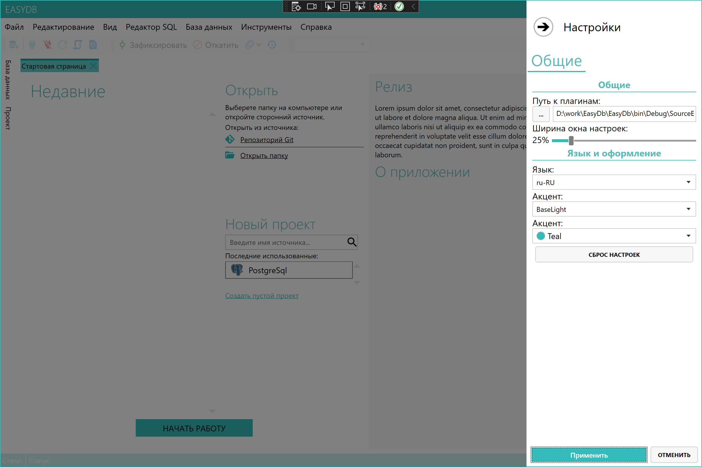

# EasyDb
EasyDb
IDE for multiple database's;

Status: Abandoned

* Color theme change support
* Dynamic language select
* Multiple database drivers support. Easy driver installation (with chocolatey)

  
   

